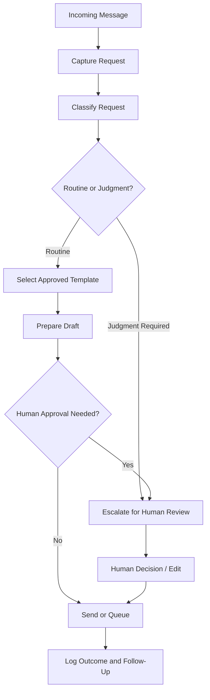

# Community Operations Automation

A public-safe case study showing how recurring community operations can be redesigned into a lighter, more reliable email workflow with clear routing, reusable templates, and human approval.

## What this project proves

This repository is designed to demonstrate a different capability from my [Workflow Transformation](https://github.com/dustinvaldezai/workflow-transformation) project.

That project focuses on research, synthesis, verification, and decision support. This one focuses on **operational automation**: identifying repetitive work, separating routine handling from judgment-heavy cases, and designing a workflow that reduces manual effort without removing human oversight.

## Verified result

In my work leading operations for a community garden organization, I automated an email workflow that reduced the recurring workload from **12 hours per week to 1 hour per week**, saving **572 hours per year** and an estimated **$17,131 in labor**.

Those figures are drawn from my verified accomplishment record. The public materials in this repository are intentionally sanitized. They do **not** claim to reproduce the exact production stack, private messages, member information, or internal operating details.

## The operational problem

Small community organizations often rely on a few people to manage a high volume of repetitive communication. The work is usually not difficult because every message is complex. It becomes difficult because routine questions, scheduling needs, requests, reminders, exceptions, and follow-ups all arrive through the same channel.

The design problem is therefore not simply "send emails faster." It is to create a workflow that can:

1. capture an incoming request
2. identify the type of request
3. route routine cases to a reusable response path
4. flag cases that require judgment
5. prepare a draft or next action
6. require human approval where needed
7. log the outcome for follow-up

## Public-safe workflow



The purpose of the design is not to automate every message. It is to reserve human attention for the messages that actually need it.

## What to inspect first

- [Workflow architecture](docs/architecture.md) — how intake, routing, drafting, approval, and follow-up fit together
- [Decision rules](docs/decision-rules.md) — what can move through a routine path and what should be escalated
- [Implementation notes](docs/implementation-notes.md) — what is verified, what is reconstructed, and what remains intentionally generalized
- [Synthetic intake examples](examples/sample-intake.md) — fictional messages used to demonstrate routing logic
- [Synthetic routing output](examples/sample-routing-output.md) — how the same messages are classified and handled
- [Routine response prompt](prompts/routine-response.md) — a reusable drafting instruction for low-risk cases
- [Human review checklist](docs/human-review-checklist.md) — approval criteria before an operational message is used

## Repository map

```text
community-operations-automation/
├── docs/
│   ├── architecture.md
│   ├── decision-rules.md
│   ├── human-review-checklist.md
│   └── implementation-notes.md
├── examples/
│   ├── sample-intake.md
│   └── sample-routing-output.md
├── prompts/
│   └── routine-response.md
└── README.md
```

## Design principles

- Automate repetition, not judgment.
- Separate routine work from exception handling.
- Use approved patterns before generating from scratch.
- Make escalation conditions explicit.
- Keep the workflow understandable to the people operating it.
- Treat logging and follow-up as part of the system, not as cleanup.

## Why this matters

For lean organizations, workflow design is capacity design. Saving time on repetitive communication means more time can be spent on programming, relationships, education, logistics, and community-facing work.

The strongest automation is not necessarily the most technical. It is the one that removes unnecessary manual effort while remaining clear, reviewable, and usable by the people who depend on it.
