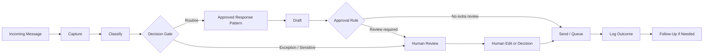

# Workflow Architecture

This document shows a public-safe reference architecture for a recurring community email workflow.

It is a sanitized reconstruction intended to demonstrate the design logic behind the case study. It does not claim to reproduce the exact production stack or private operating details used in the original implementation.

## Stage responsibilities

**Capture** records the request in a consistent form so it can be handled without relying on memory.

**Classify** identifies what kind of request it is and whether a known response pattern applies.

**Decision gate** separates routine work from cases that require judgment, privacy awareness, policy interpretation, conflict resolution, or a nonstandard commitment.

**Approved response pattern** provides a reusable structure for common cases instead of drafting every response from zero.

**Draft** adapts the response pattern to the specific request while preserving factual boundaries.

**Human review** handles exceptions and higher-risk communication.

**Log outcome** preserves what happened and whether a follow-up is still owed.

## Design intent

The architecture is intentionally simple. The goal is not to maximize automation steps. The goal is to reduce repetitive handling while keeping judgment visible and accountable.
